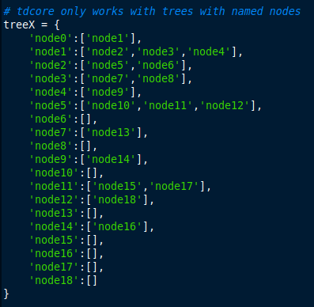
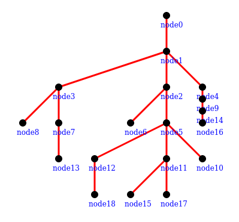

#  treedrawing
Naive Rooted Tree Drawing Algorithm

### The objective is simple. From this . . .

### . . . to this!

Of course, the tree data above is just an example. Input tree can be a "pointer" to database, spreadsheet, etc.

Parts of the algorithm are recursive. Hence, expect the performance to be slower and memory-intensive for larger trees.

#### Algorithm Description
https://github.com/poypoyan/matematex/blob/main/files/treedrawing.pdf

#### TODO
- Drawing of edited input tree
- Port on other languages (e.g. C++)

#### Installation & Tutorial
1. Just download the ZIP for this repository, extract to a folder.
2. Just run `python example.py` (Windows) or `python3 example.py` (Lunix) in your terminal.
3. The `example.py` contains information on how to use `tdcore.py`.

Found a bug? Suggest a feature? Please post on [issues](https://github.com/poypoyan/tree_drawing/issues).